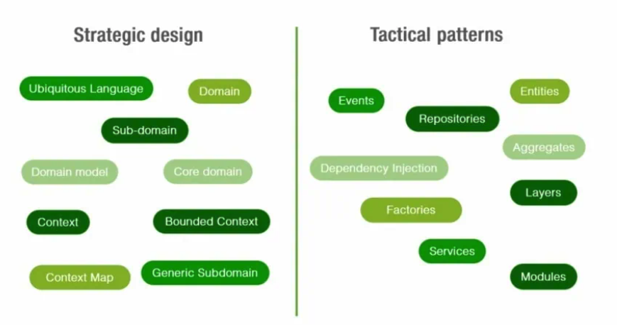
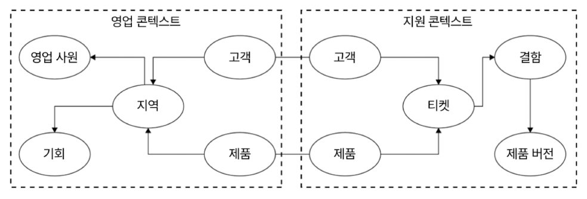
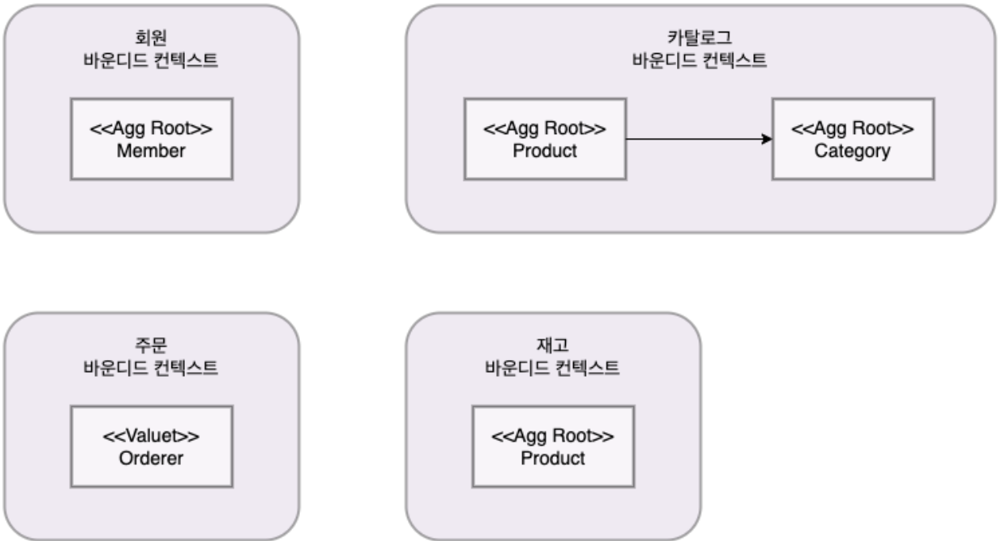
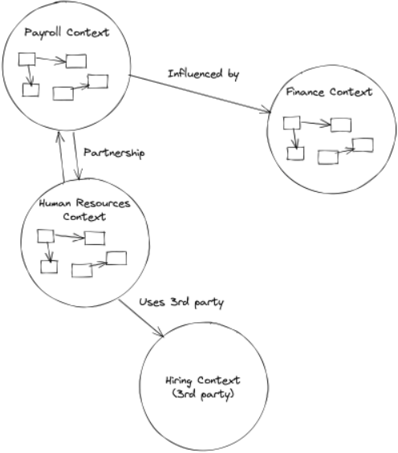

# 도메인 분해

## 도메인이란?

DDD에서의 도메인은 **비지니스 도메인**을 말하며, 실세계에서 사건이 발생하는 집합으로, 쇼핑몰을 예로들면 손님들이 주문하는 도메인이 있을 수 있고, 직원들이 옷들을 관리하는 도메인이 있을 수 있고, 결제를 담당하는 도메인이 있을 수 있음. 그리고 도메인은 명확하게 정해져있지 않고 **관점에 따라 계속 바뀔 수 있음**

## 도메인 주도 설계란?

보통 소프트웨어는 구성원 개개인이 복잡한 도메인에 대한 이해와 탐구가 부족한 상태에서 본인이 담당한 업무와 관련한 내용을 개발함. 그리고 나중에 보면 중요한 것과 덜 중요한 것이 하나의 큰 덩어리로 엉키게되고, 이는 코드 가독성 및 유지보수 저해로 이어짐. 이를 해결하고자 복잡한 도메인과 도메인 모델을 정확히 이해하고 비즈니스에 포함된 도메인을 여러 도메인으로 나누어서 하나씩 개발해 나가는 것을 의미

## 도메인 주도 설계와 마이크로 프론트엔드는 무슨 관련이 있는가?

도메인 주도 설계는 마이크로 프론트엔드에 있어서 다음 두 가지 역할을 수행

- 명확한 경계를 가진 마이크로 프론트엔드 정의
- 경계를 설정하기 위한 전략 수립

## 전략적 설계와 전술적 설계

도메인 주도 설계는 서비스 설계를 크게 다음 두 단계로 나눔

1. 전략적 설계
2. 전술적 설계

먼저 전략적 설계는 Context 안에서 도메인 지식을 공유하고 이해함으로써 유비쿼터스 언어 및 Bounded Context를 정의하고 Context Map을 도출하여 Product의 기본을 설계

기술적 설계는 앞서 도출된 Product의 내부를 설계하는 것으로, 도메인 모델과 모듈, 서비스 인터페이스와 API 등의 설계를 통하여 결과적으로는 UML의 Class Diagram의 형태로 그려지게됨

## 유비쿼터스 언어(UL, Ubiquitous language)

DDD는 도메인에 대해 학습하고, 도메인 전문가들과 대화하는 지속적인 과정이 필요한데 이때 모든 사라믈이 같은 언어를 사용. 이 언어는 모든 곳(대화, 문서, 소스코드)에서 사용되며, 이를 유비쿼터스 언어라고 칭함

## 바운디드 컨텍스트 (BC, Bounded Context)

하나의 컨텍스트 내에서만 **특정 모델과 용어를 사용하도록 함으로써 혼란을 줄이고, 각 컨텍스트가 독립적으로 관리**되도록 한다. 이를 통해 복잡한 시스템을 더 쉽게 이해하고, 관리할 수 있음

영업 컨텍스트 안에서의 고객 Entity와 지원 컨텍스트 안에서의 고객 Entity는 서로 다름. 영업 컨텍스트 내에서 고객의 지역에 관심을 갖게되며, 지원(Support) 컨텍스트 내에서는 고객이 티켓을 발부하는 것에 관심을 갖게됨.

만약 어떤 회원이 어떤 제품의 카탈로그를 보고 주문을 넣을 수 있고, 재고에 따라서 주문이 될 수도 있고 안 될수도 있는 상황을 가정해보면, 이 상황에서는 바운디드 컨텍스트가 크게 아래와 같이 쪼개질 수 있음

카탈로그 컨텍스트 안에서의 Product는 Category의 Product와 연관을 맺지만 재고 컨텍스트 안에서의 Product는 Category와 연관을 맺지 않는다.각자의 바운디드 컨텍스트에 있는 Product 엔터티는 개념이 다름. 이는 회원과 주문 컨텍스트도 마찬가지

**BC는 자체 UL을 가지며, UL이 BC의 식별을 이끌어낸다**

## 컨텍스트 맵

BC 들간의 관계를 보여주는 그림으로, 모든 관계는 다음 패턴들 중 하나로 분류.

- Partnership
- Shared Kernel
- Customer-Supplier
- Conformist
- Anticorruption Layer
- Open Host Service
- Published Language
- Separate Ways
- Big Ball of Mud

컨텍스트 맵은 경계 컨텍스트간의 관계를 시각화하며, 모든 사람이 전체적인 관점을 가질 수 있게 해주어 초기에 갈등을 해결하고 모델의 무결성을 손상시키는 것을 방지할 수 있음

위 이미지를보면 Payroll 팀과 Human Resources 팀은 파트너십을 가지며 하나의 프로젝트에서 함께 일하며, Payroll 팀은 Finance Context가 변경되면 수정돼야 함을 알 수 있음

## 도메인 주도 설계는 프론트엔드에서 어떻게 적용될 수 있는가?

[single-spa](https://single-spa.js.org/), [FrintJS](https://frint.js.org/), [Luigi](https://luigi-project.io/) 등의 라이브러리나 혹은 프레임워크 사용이 가능.

**기존의 모놀리식 애플리케이션을 더 모듈화된 아키텍처로 마이그레이션 할 때 매우 효과적일 수 있음**

## 기타 참고 문헌

[마이크로서비스 설계를 잘 할 수 있게 해주는 기법, 도메인 주도 설계에 대해 알아보기](https://devocean.sk.com/blog/techBoardDetail.do?ID=165765&boardType=techBlog)

[Applying Domain-Driven Design (DDD) Principles in Frontend Development | by Alae Achhab | Medium](https://alaedev.medium.com/applying-domain-driven-design-ddd-principles-in-frontend-development-fc67c8d28cc9)

[msaschool - msaschool](https://www.msaschool.io/operation/design/design-two/)

[DDD - 바운디드 컨텍스트란 무엇인가 ?!](https://jaehoney.tistory.com/252)

[domain driven design - What difference between Context Map and Bounded Context in DDD? - Stack Overflow](https://stackoverflow.com/questions/57637489/what-difference-between-context-map-and-bounded-context-in-ddd)

[DDD Series: Bounded Context Integration I - Context Map - Nicolás Bottarini Blog](https://nbottarini.com/en/posts/2022/09/22/ddd_bounded_context_integration_i/)

[heikkilamarko/micro-frontends-app: A simple micro frontends application written in Svelte and React](https://github.com/heikkilamarko/micro-frontends-app?tab=readme-ov-file)

[DDD(Domain-Driven Design) 계층구조(Layered Architecture) 알아보기](https://dev-coco.tistory.com/166)
