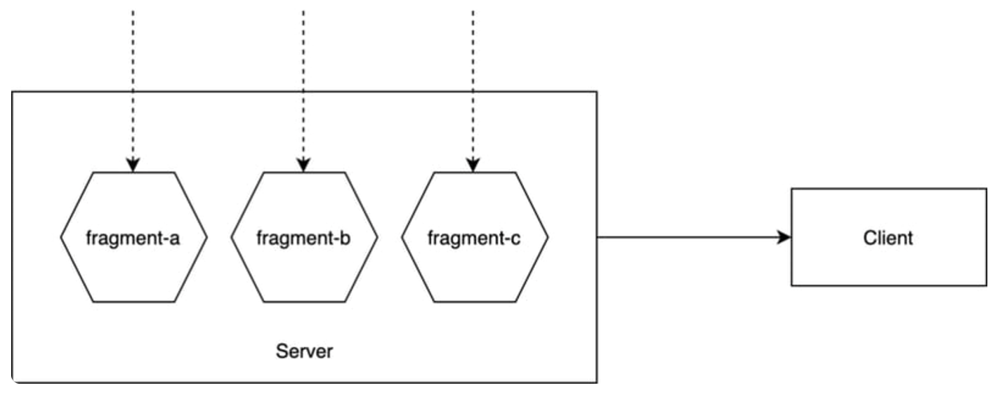
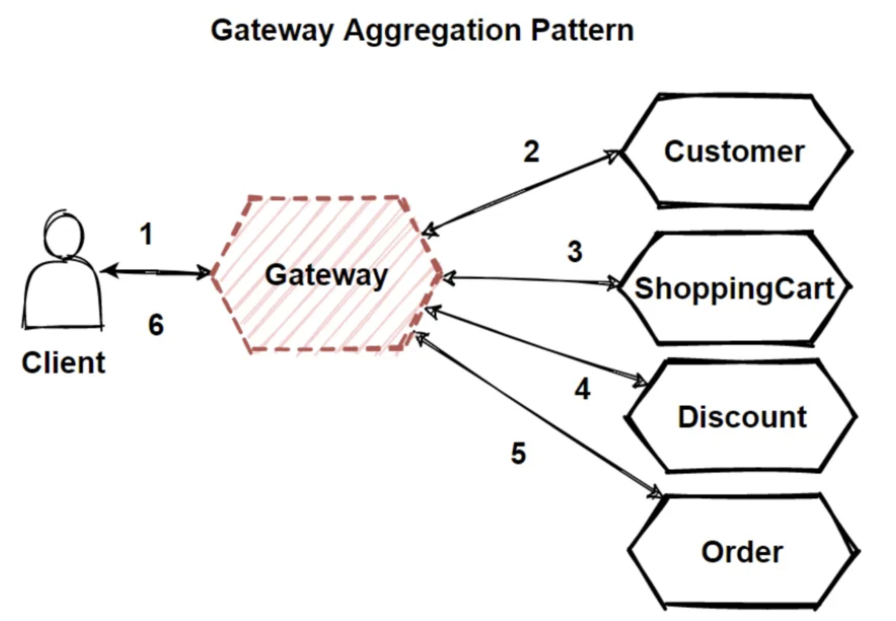
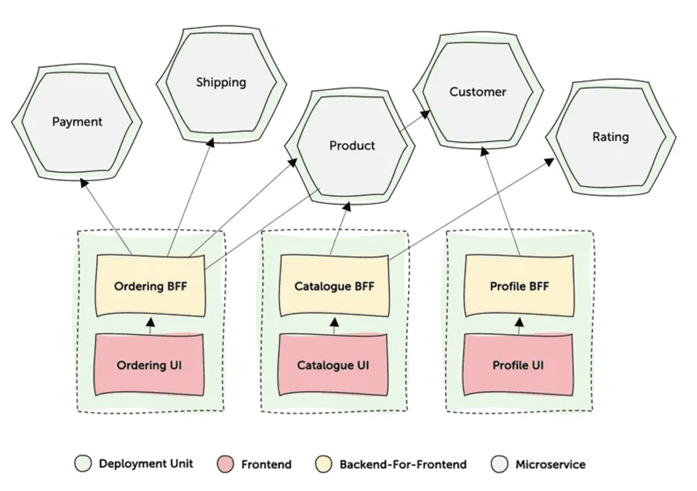
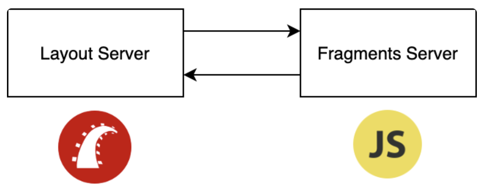
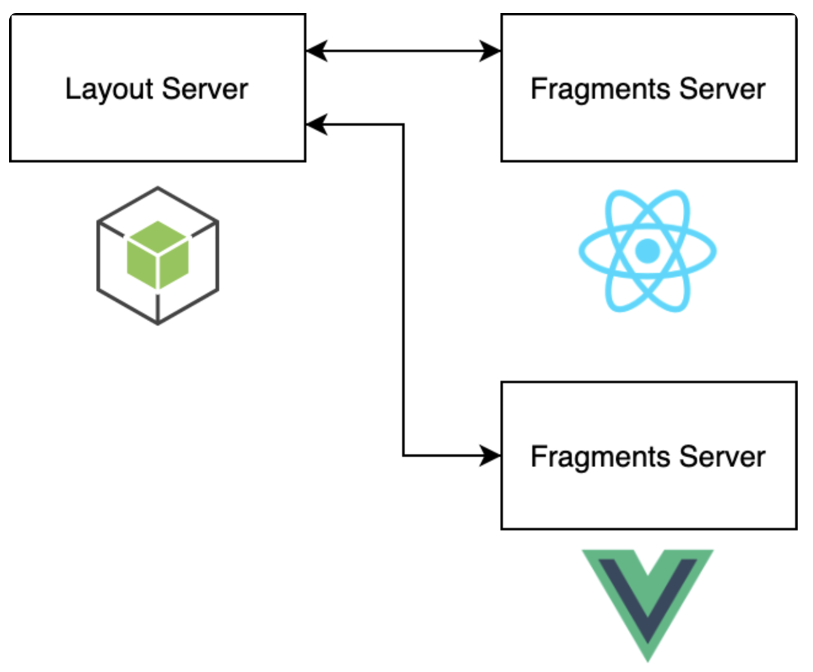
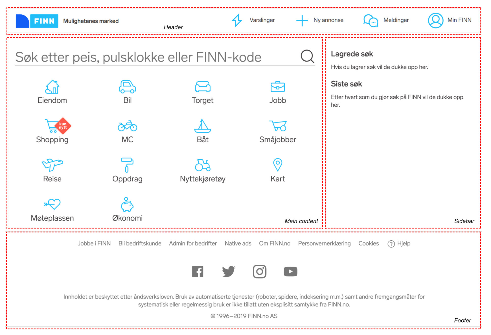
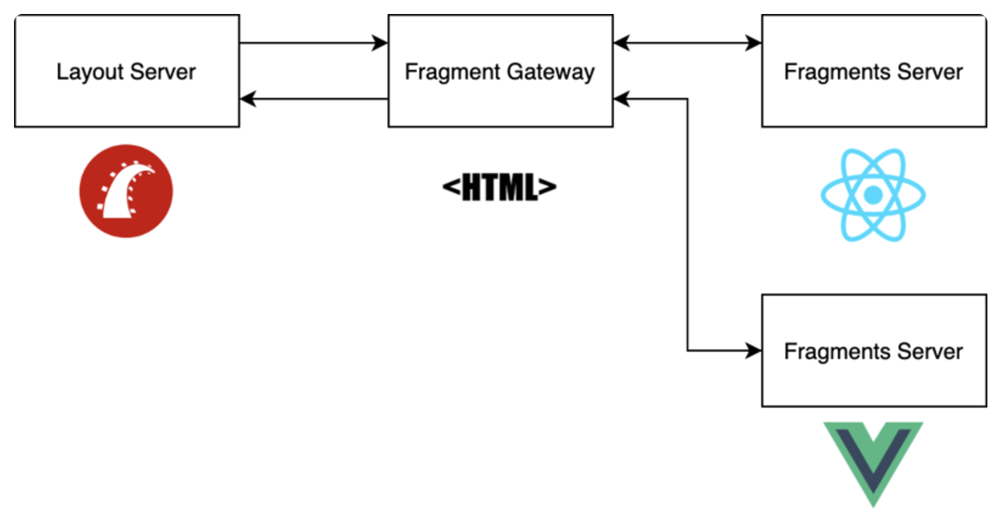
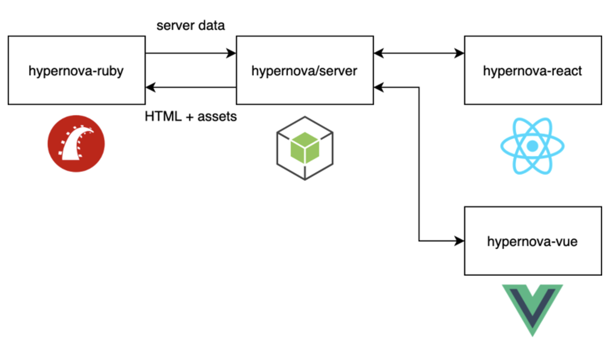

## 이전에 배운 것 Review

마이크로 프론트엔드는 다음과 같은 특징이 존재한다.

- 느슨한 결합도, 높은 응집도
- 독립적인 배포
- 비지니스 도메인별로 경계 구분
- 자율적인 팀 개발

## Server Side Composition

서버 측 구성은 Server Side Composition을 의미하며 하나의 패턴이다. 이 패턴은 서버에서 다양한 마이크로 프론트엔드를 조합하여 하나의 HTML을 완성한 뒤 클라이언트에 전달하는 방식이다.

이 패턴을 구현하는데 있어서 크게 다음 두 가지 종류가 존재한다.

1. Layout Server + Fragment Server의 조합
2. Layout Server + Fragment Gateway + Fragment Server의 조합

이 방법들에 대해 이야기하기 전에 먼저 마이크로 서비스를 위한 디자인 패턴인 Gateway Aggregation, BFF 패턴들에 대해서 알아보자.

## Gateway Aggregation Pattern (게이트웨이 집계 패턴)

하나의 게이트웨이가 내부 마이크로서비스 요청을 하나의 요청으로 클라이언트에 노출하는 구조로, 클라이언트가 여러 백엔드 마이크로서비스를 호출해야 할때 사용한다. 게이트웨이가 요청을 수신하여 백엔드 서비스로 전달하고 결과를 집계한 후 클라이언트에 반환하기 때문에 다음과 같은 장점을 얻을 수 있다.

1. 네트워크 지연 감소
2. 백엔드 요청 수 감소

## Backends For Frontend (BFF)

Frontend를 위한 dedicated한 backend를 만드는 방식으로 클라이언트가 필요로 하는 형태의 데이터를 정확히 제공하는 구조로 하나의 Frontend에 대응하는 BFF가 오직 하나만 존재하는 구조다.

## Layout Server (LS) + Fragment Server (FS)

Server Side Composition 패턴 중 가장 간단한 구조이다.

LS는 서버 사이드 애플리케이션으로 Rails, PHP, Node.js가 해당된다. FS는 리액트가 될수도 있고, 뷰가 될수도 있다. LS는 FS가 반환하는 Fragment를 조합해서 최종 HTML, CSS, JS를 생성한다.

만약 FS가 두개 존재하는데 하나는 리액트고 하나는 뷰라고 한다면, 리액트는 React Component를 LS에 전달하고, 뷰는 Vue Component를 LS에 전달한다. 그리고 LS는 둘을 파싱하여 조합한다.

이 조합은 SSR을 하는 경우 문제가 된다. LS가 FS에 SSR을 위한 데이터를 전달하면 이를 받을 수 있는 인터페이스가 존재해야하며, 이를 SSR해서 내려주어야한다. 복잡도가 증가한다.

[Podium](https://podium-lib.io/docs/) 프레임워크가 딱 이구조를 채택하고 있다.

Podium은 크게 두 가지 기능을 제공한다. 첫 번째는 `Podlet`이라고 부르는 프래그먼트, 그리고 두 번째는 Podlet을 가져와 페이지의 적절한 위치에 배치하는 `Layout`이다.

[Docs](https://podium-lib.io/docs/)에서 위 사진을 언급하고 있는데, 헤더, 푸터, 사이드바, 메인 컨텐츠 영역은 각각 4개의 `Podlet`이 존재하고, Podium의 `Layout`이 각각을 합쳐서 하나의 페이지를 만들어낸다.

## Layout Server (LS) + Fragment Gateway (FG) + Fragment Server (FS)

이 구조에서는 SSR은 FG가 담당하게 된다.

Fragment Gateway는 Gateway Aggregation과 비슷하다. 여러 FS에 접근하는 것을 관리하고, 여러 FS에 대한 인터페이스를 통합한다.

[HyperNova](https://github.com/airbnb/hypernova)를 사용하는 경우, LS는 FS가 SSR하기 위한 데이터를 생성하고 FG에 전달하면 FG가 컴포넌트에 데이터를 삽입하여 완성된 HTML을 반환하는 구조다.

## Server Side Composition의 장점과 단점

장점은 흔히 알고 있는 SEO 향상, Frontend에 전달되는 스크립트 파일량 감소, initial load 시간 향상 등, SSR이 가지고 있는 장점을 가지고있다.

단점은 서버 부하 증가, 마이크로 프론트엔드를 조합함으로서 발생하는 지연시간 증가 등 SSR이 가지고 있는 단점을 가지고있다.

## References

[Micro Frontends Patterns#12: Server Side Composition - DEV Community](https://dev.to/okmttdhr/micro-frontends-patters-13-server-side-composition-1of5)

[Micro Frontends Patterns#5: Microservice Architecture - DEV Community](https://dev.to/okmttdhr/micro-frontends-patterns-microservice-architecture-1j36)

[Gateway Aggregation Pattern. In this article, we are going to talk… | by Mehmet Ozkaya | Design Microservices Architecture with Patterns & Principles | Medium](https://medium.com/design-microservices-architecture-with-patterns/gateway-aggregation-pattern-9ff92e1771d0)

[Understanding Server-Side and Client-Side Composition in Microfrontends | by Arunangshu Das | Medium](https://arunangshudas.medium.com/understanding-server-side-and-client-side-composition-in-microfrontends-55814b5efe20)

[Introduction | Podium.io](https://podium-lib.io/docs/)
