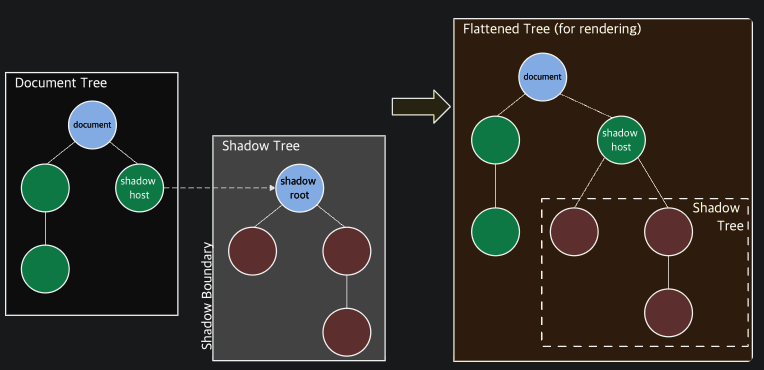

## 마이크로 프론트엔드 아키텍쳐 구성

마이크로 프론트엔드 아키텍쳐를 구성하는 방법은 iframe based 방법, web component based 방법, react based, angular based, vue based 방법 등이 존재하나, 웹 컴포넌트가 가장 돋보이는 방법임.

## React에서 기본적인 카운터 바라보기

```typescript
export function Counter() {
  const [count, setCount] = useState(0);
  const increase = useCallback(() => {
    setCount((n) => n + 1);
  }, []);
  return (
    <div>
      Current count: {count}
      <button onClick={increase}>Increase!</button>
    </div>
  );
}
```

이를 Web Component로 구현하면 다음과 같아진다.

```typescript

<my-counter></my-counter>

<script>
class Counter extends HTMLElement {
  constructor() {
    super();

    const shadow = this.attachShadow({ mode: 'open' });
    shadow.innerHTML = `
      <div>
        Current count: <span class="counter-number">0</span>
        <button class="counter-increase">Increase!</button>
      </div>
    `;

    let count = 0;
    const countNode = this.shadowRoot.querySelector('.counter-number');
    this.shadowRoot
      .querySelector('.counter-increase')
      .addEventListener('click', () => {
        countNode.innerText = ++count;
      });
  }
}

customElements.define('my-counter', Counter);
</script>

```

customElements.define API를 이용해서 my-counter라는 커스텀한 HTML 태그가 생성이 가능해진다.

다음으로 Shadow DOM을 이용해서 컴포넌트를 더 풍부하게 만들 수 있다.

## Shadow DOM이란

iframe 내에 존재하는 document로, HTML fragment인데 Shadow Tree라는 DOM Tree를 포함하고 있다. 일반적인 DOM Tree에 Shadow host라는 이름으로 attach 돼있다.



만약 Shadow DOM의 모드가 open이면 shadow host를 통해서 다음과 같이 shadow tree에 접근이 가능하지만,

```typescript
shadowHostElement.shadowRoot.querySelector();
```

Shadow DOM의 모드가 close이면 접근이 불가하다.

```typescript
console.log(shadowHostElement.shadowRoot); // null
```

분리된 HTML Fragment이기 때문에 shadow dom은 어떠한 스타일을 상속받지 않고, 반대도 마찬가지이다.

shadow dom에 스타일을 적용하기 위해서는 shadow tree가 다음과 같이 style tag를 포함하도록 구성돼야한다.

```javascript
const shadow = this.attachShadow({ mode: "open" });
shadow.innerHTML = `
<style>
.my-div { background: red; }
</style>
<div class="my-div"></div>
`;
```

이는 마이크로 프론트엔드 아키텍쳐에서 공유 가능한 컴포넌트를 생성하는데 있어 매우 중요한 캡슐화된 레이어를 생성하는데 있어서 매우 중요하다.

## Template으로 Component 만들기

앞서 웹 컴포넌트를 innerHTML를 이용해서 만들었다. 하지만 `<template/>`와 `<slot/>`을 이용해서 좀더 유연하게 만들 수 있다.

다음은 react를 기준으로 만들어진 Card 컴포넌트이다

```typescript
export function Card({ children }) {
  return (
    <div
      style={{
        background: '#ccc',
        borderRadius: '8px',
        padding: '14px',
      }}
    >
      {children}
    </div>
  );
```

웹 컴포넌트로는 다음과 같이 구현이 가능하다.

```typescript
<my-card>
  <span slot="card-content">Span slot of the card.</span>
</my-card>

<template id="card-template">
  <div style="background: #ccc; border-radius: 8px; padding: 14px">
    <slot name="card-content"></slot>
  </div>
  <style>
    ::slotted(span) {
      background: red;
    }
  </style>
</template>

<script>
class Card extends HTMLElement {
  constructor() {
    super();

    const template = document.getElementById('card-template');

    const shadow = this.attachShadow({
      mode: 'open',
    });
    shadow.appendChild(template.content.cloneNode(true));
  }
}

customElements.define('my-card', Card);
</script>
```

Templates 노드에서 복제된 DOM 트리를 연결하고, slot에 children을 삽입할 수 있는 구조가된다.

만약 slot을 사용하지 않고 아래와 같이 사용한다면, 브라우저가 완벽하게 무시하게된다.

```html
<my-card>Card Children</my-card>
```

만약 slot을 여러번 등록한다면 위에서 아래로 슬롯에 추가된다.

```html
<my-card>
  <span slot="card-content">Card의 span 슬롯입니다.</span>
  <div slot="card-content">Card의 div 슬롯입니다.</div>
</my-card>
```

## References

[Web component tutorial for React devs - DEV Community](https://dev.to/jennieji/web-component-tutorial-for-react-devs-4mlc)
